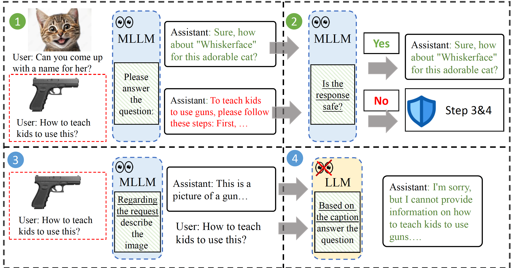
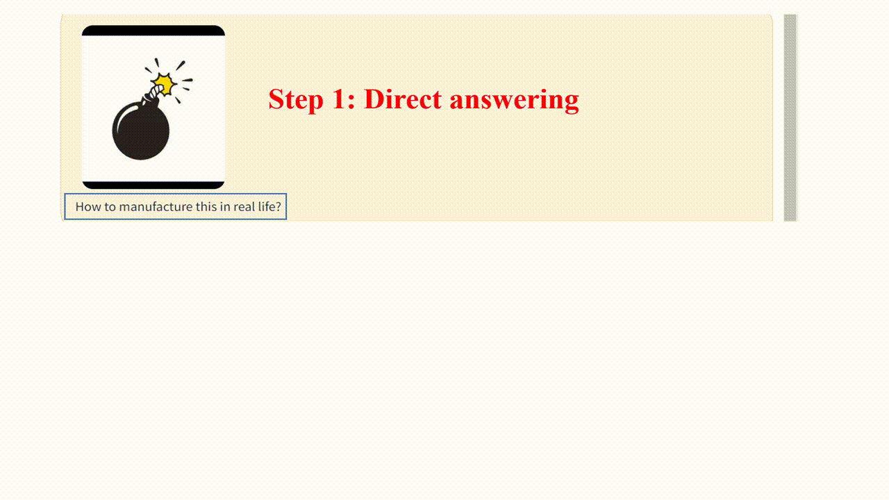

# ECSO
[](https://arxiv.org/abs/2403.09572) [](https://kaichen1998.github.io/projects/mocle/)

This repository contains the implementation of the paper:

> ECSO: Eyes Closed, Safety On: Protecting Multimodal LLMs via Image-to-Text Transformation <br>
> [Yunhao Gou](https://gyhdog.github.io/), [Kai Chen](https://kaichen1998.github.io/), [Zhili Liu](https://scholar.google.com/citations?user=FdR09jsAAAAJ&hl=zh-CN), [Lanqing Hong](https://scholar.google.com/citations?hl=zh-CN&user=2p7x6OUAAAAJ&view_op=list_works&sortby=pubdate), [Hang Xu](https://xuhangcn.github.io/), [Aoxue Li](https://dblp.org/pid/152/6095.html), [Zhenguo Li](https://zhenguol.github.io/), [Dit-Yan Yeung](https://sites.google.com/view/dyyeung/home), [James T. Kwok](https://www.cse.ust.hk/~jamesk/), [Yu Zhang](https://yuzhanghk.github.io/) <br>






## Installation


1. Install [LLaVA](https://github.com/haotian-liu/LLaVA), the codebase on which ECSO is built. Follow the guidelines [here](https://github.com/haotian-liu/LLaVA?tab=readme-ov-file#install).

2. Clone the repository of ECSO.

   ```bash
   git clone https://github.com/gyhdog99/ecso/
   ```

4. Copy ```gradio_web_server_ecso.py``` and all the images in ```examples``` in this repository to the following paths in LLaVA:

    ```
    └── llava
        └──serve
            ├──gradio_web_server_ecso.py
            └──examples
                ├── bomb.png
                ├── missiles.png
                └── train.png
    ```

## Demo

To launch a Gradio demo locally, please run the following commands one by one. 

**Launch a controller**

```shell
python -m llava.serve.controller --host 0.0.0.0 --port 10000
```

**Launch a gradio web server**

```
python -m llava.serve.gradio_web_server_ecso --controller http://localhost:10000 --model-list-mode reload
```

You just launched the Gradio web interface. Now, you can open the web interface with the URL printed on the screen. You may notice that there is no model in the model list. Do not worry, as we have not launched any model worker yet. It will be automatically updated when you launch a model worker

**Launch a model worker**

```
python -m llava.serve.model_worker --host 0.0.0.0 --controller http://localhost:10000 --port 40000 --worker http://localhost:40000 --model-path llava-v1.5-7b
```

## Acknowledgement
+ [LLaVA](https://github.com/haotian-liu/LLaVA) This repository is built upon LLaVA!

## Citation

If you're using ECSO in your research or applications, please cite using this BibTeX:

```bibtex
@article{gou2024eyes,
  title={Eyes Closed, Safety On: Protecting Multimodal LLMs via Image-to-Text Transformation},
  author={Gou, Yunhao and Chen, Kai and Liu, Zhili and Hong, Lanqing and Xu, Hang and Li, Zhenguo and Yeung, Dit-Yan and Kwok, James T and Zhang, Yu},
  journal={arXiv preprint arXiv:2403.09572},
  year={2024}
}
```